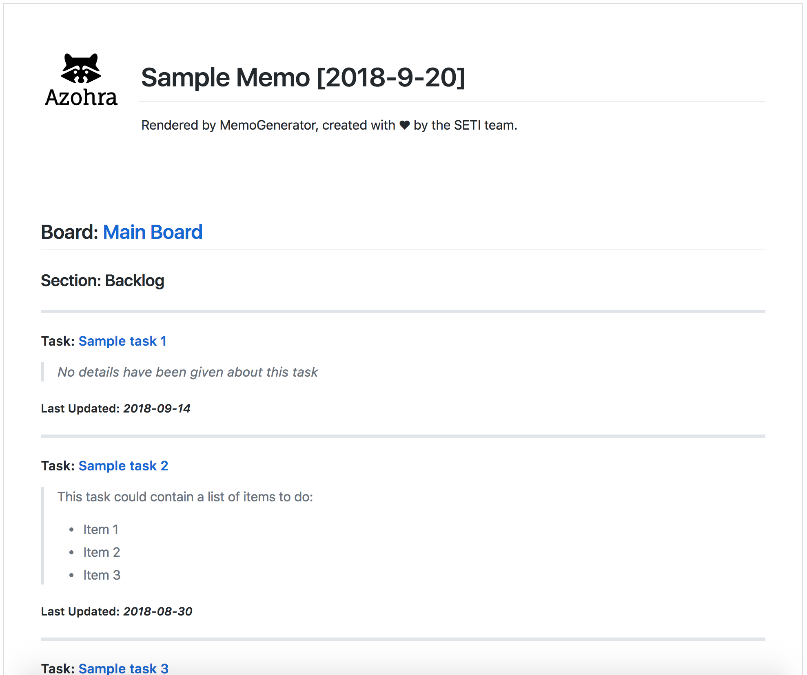

# MemoGenerator

### An Elixir application to generate a memo by scraping your team's trello boards.



## Installation

If [available in Hex](https://hex.pm/docs/publish), the package can be installed
by adding `memo_generator` to your list of dependencies in `mix.exs`:

```elixir
def deps do
  [
    {:memo_generator, "~> 0.1.0"}
  ]
end
```

## Configuration

```elixir
# Used to Authenticate your bot into the Trello workspace
config :memo_generator, api_key: System.get_env("TRELLO_API_KEY")
config :memo_generator, api_token: System.get_env("TRELLO_API_TOKEN")
```

## Functions

```Elixir
  # Customize what attributes you want on your memo
  
  # You can chose between a text splash
  attributes = %{splash: "<p>Please read carefully</p>"}
  
  # A company logo
  attributes = %{logo: "https://www.company.com/logo"}
  
  # Or both
  attributes = %{splash: "<p>Please read carefully</p>", logo: "https://www.company.com/logo"}


  # To generate a memo for all boards with no added attributes
  def go(:all, filename, title) do
  #   ...
  end

  # To generate a memo for a list of  boards with no added attributes
  def go(["Board_1", "Board_2"], filename, title) do
  #   ...
  end

  # To generate a memo for all boards with added attributes
  def go(:all, filename, title, attributes) do
  #   ...
  end

  # To generate a memo for a list of  boards with added attributes
  def go(["Board_1", "Board_2"], filename, title, attributes) do
  #   ...
  end

  # To return a list of all boards the application has access to
  def get_all_board_names do
  # ...
  end

  # To delete a rendered memo from your file system
  def delete(filename) do
  # ...
  end
```

## Usage Examples

### Use the function within your Elixir application...

```Elixir
  # ... inside your application

  def your_api(conn, assigns) do
    %{
      board_list: boards,
      title: title,
      filename: filename,
      opts: opts,
      ...
    } = assigns

    MemoGenerator.go(boards, filename, title, opts)

    send_file(conn, filename)

    MemoGenerator.delete(filename)

    conn
  end
```

### or you can use it through iex
```console
iex(1)> MemoGenerator.go(["Backlog", "Secret Project"], "eCommerce-memo.md", "Weekly Memo - eCommerce", %{logo: "https://www.company.com/logo"})

16:04:44.341 [info]  Rendered logo

16:04:44.355 [info]  Rendered all cards for list: Backlog
 
16:04:44.430 [info]  Rendered all cards for list: Focused
 
16:04:44.502 [info]  Rendered all cards for list: Doing
 
16:04:44.586 [info]  Rendered all cards for list: Done
 
16:04:44.587 [info]  Rendered all cards and lists for board: Main
 
16:04:44.745 [info]  Rendered all cards for list: Backlog
 
16:04:44.820 [info]  Rendered all cards for list: Focused
 
16:04:44.897 [info]  Rendered all cards for list: Doing
 
16:04:44.974 [info]  Rendered all cards for list: Done
 
16:04:44.974 [info]  Rendered all cards and lists for board: Secret Project

16:04:44.974 [info]  Finished rendering: Weekly Memo - eCommerce, into file: eCommerce-memo.md

:ok
```

<p>Created with &#x2665; by Azohra.<p>
